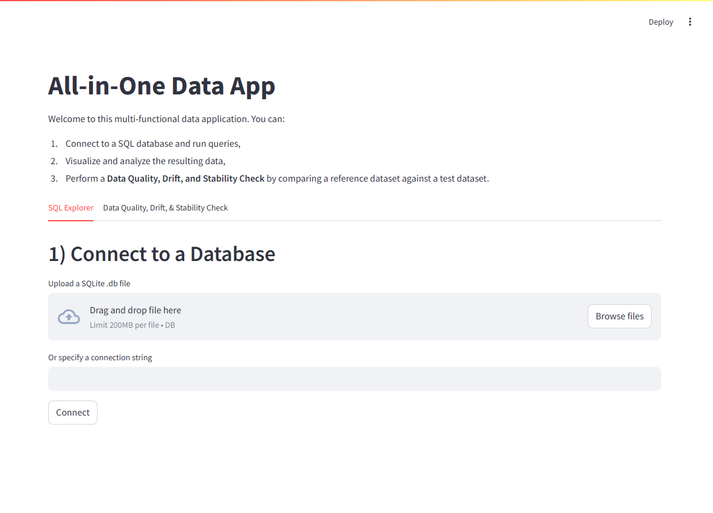
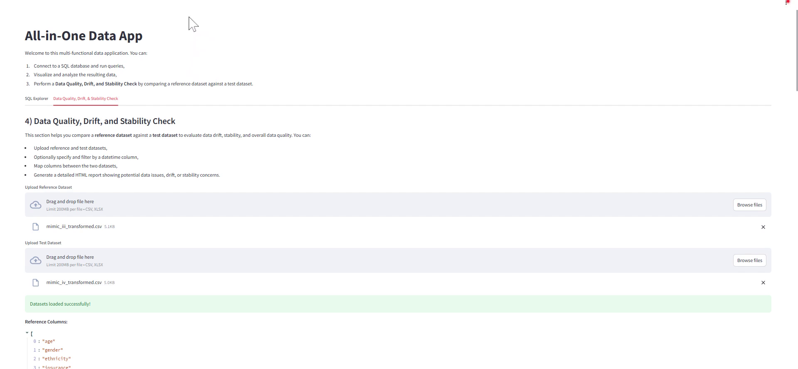
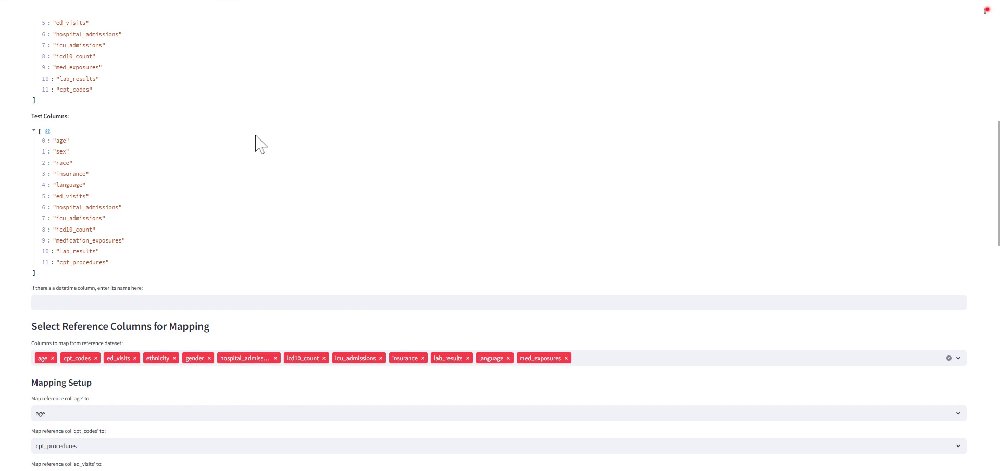
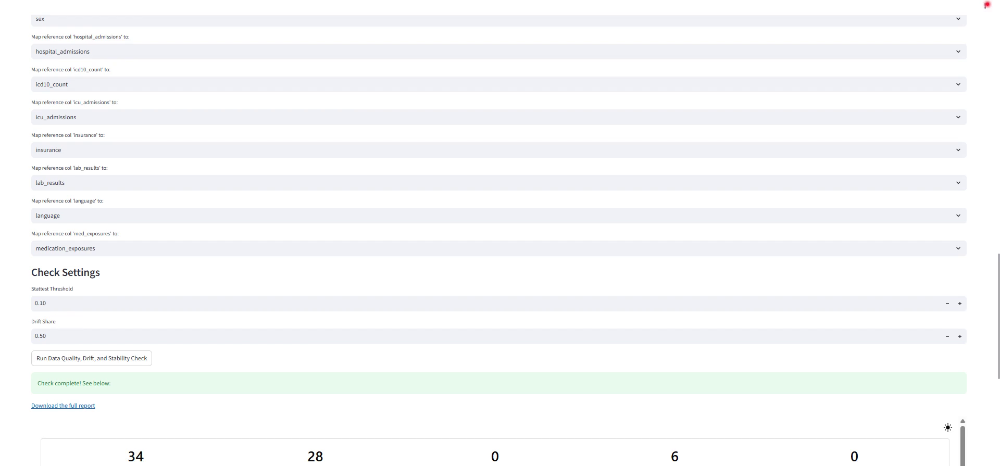
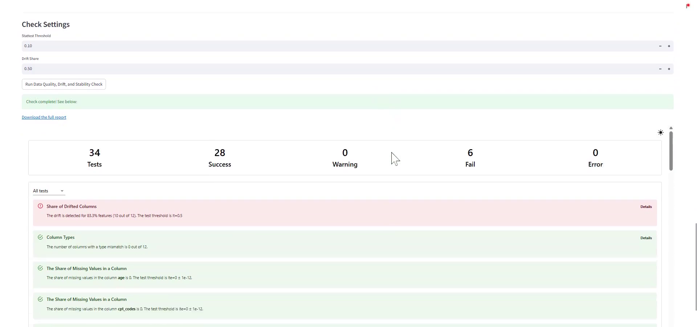
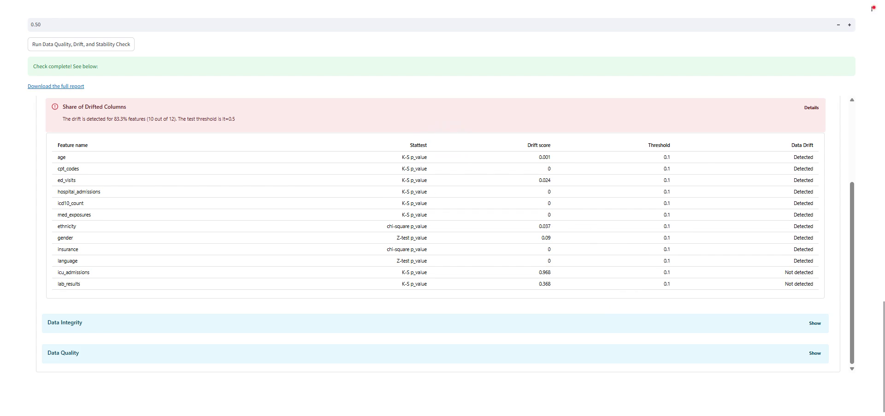
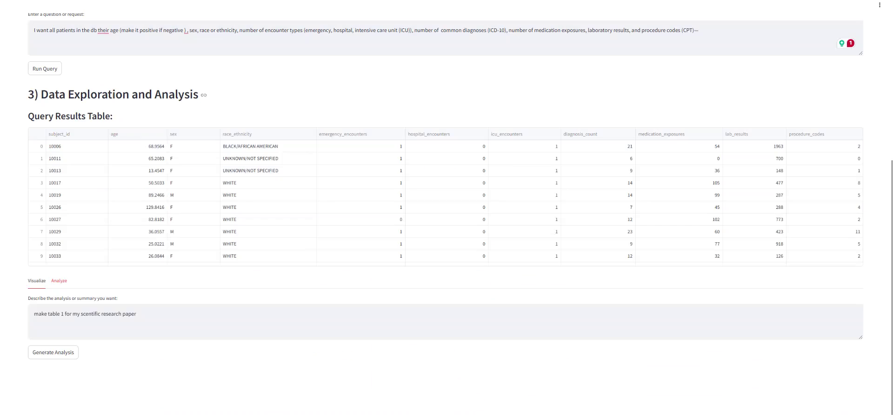
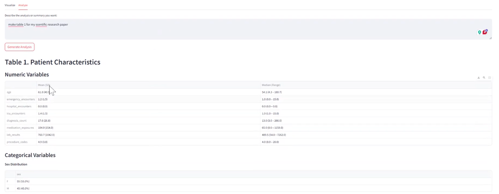

<!--  -->

  

# AllInOneDataApp

AllInOneDataApp is a Streamlit-powered data application that integrates SQL exploration, AI-driven data visualization and analysis, and data quality checks into one tool. It allows users to connect to a database, ask questions in natural language to generate SQL queries, visualize query results, and compare datasets for data drift and stability.

## Features
- **SQL Explorer:** Connect to SQLite or other databases and run queries (including NL->SQL via OpenAI).
- **AI-Powered Visualization:** Describe a chart and let the app generate Matplotlib/Seaborn visuals automatically.
- **AI-Powered Analysis:** Ask for insights and get a Python analysis of the data (using pandas and Streamlit outputs).
- **Data Quality & Drift Check:** Upload reference and test datasets to generate an Evidently report on data drift and stability.

## Quick Start
**Quick Start**

*Using Docker Compose:*
1. Ensure you have Docker installed. 
2. Copy the example environment variables: `cp .env.example .env` (and insert your OpenAI API key).
3. Build and run the container: `docker-compose up --build`.
4. Open your browser to [http://localhost:8501](http://localhost:8501) to access the app.

*Using Python/pip:*
1. Install Python 3.10+ and install requirements: `pip install -r requirements.txt`.
2. Copy `.env.example` to `.env` and add your `OPENAI_API_KEY`.
3. Run the app: `streamlit run app/app.py` (the app will launch at localhost:8501).

**Environment Variables:** Before running, make sure to configure the environment variables by copying `.env.example` to `.env` and adding your OpenAI API key.

## Screenshots

| # | Stage | Preview |
|---|-------|---------|
| 1 | **App landing** – main menu & tabs |  |
| 2 | **Data-quality tab (datasets loaded)** |  |
| 3 | **Select & map columns** |  |
| 4 | **Run data-quality / drift check** |  |
| 5 | **Summary overview (KPI bar)** |  |
| 6 | **Drift details table** |  |
| 7 | **SQL query results & analysis panel** |  |
| 8 | **Auto-generated Table 1 (patient characteristics)** |  |

## Contributing
**Contributing:** Contributions are welcome! Please fork the repository and open a pull request. For major changes, discuss via an issue first. Ensure that you run `ruff` for linting and `pytest` for tests before submitting.
